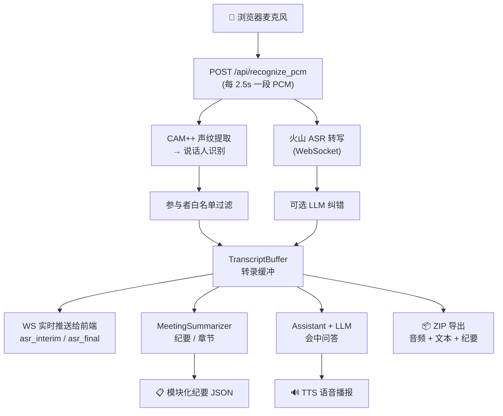

# EchoPass

**自部署的实时语音会议助手** — 浏览器录音，自动转写、识别说话人、生成 AI 纪要和章节，支持语音唤醒与会中问答。

> 在线 Demo：[https://8.130.124.121:8765](https://8.130.124.121:8765/)（自签 HTTPS，需点「高级 → 继续访问」；服务器配置较低，首次访问可能稍慢）


---

## 目录

- [能做什么](#能做什么)
- [项目结构](#项目结构)
- [工作原理](#工作原理)
- [快速开始](#快速开始)
- [配置说明](#配置说明)
- [Docker 部署](#docker-部署)
- [API 速览](#api-速览)
- [常见问题](#常见问题)
- [文档索引](#文档索引)

---

## 能做什么

| 能力 | 说明 |
|------|------|
| 🎙️ **实时转写** | 火山引擎云端流式 ASR，支持热词偏置，可选 LLM 纠错 |
| 👤 **说话人识别** | CAM++ 声纹模型，支持内存/PostgreSQL 两种存储模式 |
| 📋 **AI 纪要** | LLM 生成模块化报告（背景、议题、决议、待办），失败自动回退规则摘要 |
| 📖 **智能章节** | 按话题自动切分会议，生成标题与摘要，支持后处理去重合并 |
| 🤖 **会中助手** | 语音唤醒后对话问答，可结合会议上下文，支持流式 TTS 播报 |
| 🔊 **语音唤醒** | 可选本地「小云小云」KWS 唤醒词检测（默认关闭，需配置开启） |
| 📦 **一键导出** | 会议结束后下载 ZIP 包（原始音频 + 转录文本 + 结构化纪要） |
| 🖥️ **多会议并发** | 按 session 隔离，支持多场会议同时进行、参与者白名单过滤 |

**技术栈**：Python 3.8 · FastAPI · PyTorch 2.4 · CAM++ · FunASR · 火山引擎 ASR/TTS

---

## 项目结构

```text
EchoPass/
├── echopass/                    # Python 主包
│   ├── app.py                   # FastAPI 入口，全部 HTTP/WS API
│   ├── config.py                # 统一配置中心（环境变量 > YAML > 默认值）
│   ├── engine.py                # CAM++ 声纹 / 火山 ASR / LLM 纠错 / KWS 引擎
│   ├── campplus_model.py        # CAM++ 神经网络定义
│   ├── audio_features.py        # Kaldi 风格 FBank 特征提取
│   ├── volc_asr.py              # 火山 v2 通用 ASR 客户端
│   ├── volc_bigmodel_asr.py     # 火山 v3 大模型 ASR 客户端（豆包 2.0）
│   ├── volc_bidirectional_tts.py# 火山双向流式 TTS V3 客户端
│   ├── agent/                   # 会中助手模块
│   │   ├── dialogue_manager.py  # 唤醒后对话态 TTL 管理
│   │   ├── llm_client.py        # OpenAI 兼容 Chat 客户端（同步/流式/SSE）
│   │   └── participants.py      # 会议参与者白名单
│   ├── meeting/                 # 会议纪要模块
│   │   ├── summarizer.py        # LLM 模块化纪要 + 章节划分 + 规则回退
│   │   ├── transcript_buffer.py # 转录缓冲（按 session、同说话人合并去重）
│   │   └── cross_meeting.py     # 跨会议总结（预留）
│   ├── session/manager.py       # 多会议会话注册表（TTL 自动清理）
│   ├── transport/               # WebSocket 通信层
│   │   ├── websocket_server.py  # 会话级 WS 广播 Hub
│   │   └── schemas.py           # 事件消息结构定义
│   └── static/                  # 前端 SPA（单文件）
│       ├── index.html           # 全部 UI：录音/转写/纪要/章节/导出
│       ├── js/                  # JS 模块（章节可视化、主题切换）
│       └── audio/               # KWS 唤醒应答音效
├── config/
│   ├── prod.yaml.example        # 含注释的配置模板（去敏）
│   └── prod.yaml                # 实际配置（不入库，包含密钥）
├── scripts/                     # 启动与安装脚本
│   ├── run.sh / run.ps1         # 启动服务
│   └── first-run.sh / .ps1      # 首次安装依赖 + 生成配置
├── sql/                         # PostgreSQL 建表 DDL
├── pretrained/                  # CAM++ 权重缓存（由 ModelScope 下载）
├── ssl/                         # 自签 HTTPS 证书
├── Dockerfile                   # Docker 镜像构建
├── requirements.txt             # 精确版本锁定（含 modelscope 1.10.0 降级说明）
└── pyproject.toml               # 包元信息
```

---

## 工作原理



核心流程说明：

1. **前端** 通过浏览器采集麦克风音频，本地 RMS 阈值做简单 VAD 切句
2. **每段音频** 发送到后端，并行执行声纹识别（CAM++）和语音转写（火山 ASR）
3. **转录结果** 写入 TranscriptBuffer，同一说话人的连续发言自动去重合并
4. **实时推送** 通过 WebSocket 将识别结果实时推送给前端展示
5. **会议纪要** 由 LLM 根据转录缓存生成模块化 JSON（背景/议题/决议/待办），LLM 不可用时自动回退规则摘要
6. **AI 章节** 按话题变化自动切分会议段落，每章生成标题和摘要
7. **会中助手** 支持语音唤醒「小云小云」，结合会议上下文进行多轮问答

---

## 快速开始

### 前置要求

- **Python 3.8**（必须是 3.8，高版本有兼容性问题）
- 推荐使用 **Miniconda/Anaconda** 管理 Python 环境
- **火山引擎 ASR** 账号（获取 AppID 和 Access Token）
- **LLM API**（任意兼容 OpenAI 格式的服务，如 DeepSeek、Qwen、GLM 等）

### 步骤 1：创建环境

```bash
# 推荐 conda
conda create -n echopass python=3.8 -y
conda activate echopass
cd /path/to/ECHOPASS
```

### 步骤 2：安装依赖

```bash
./scripts/first-run.sh
```

这会自动完成：安装 Python 依赖 → 从 `config/prod.yaml.example` 复制配置模板（若尚未存在）。

### 步骤 3：填写配置

编辑 `config/prod.yaml`，**至少** 填好以下几项：

```yaml
llm:
  api_url: "https://api.deepseek.com/v1/chat/completions"  # 你的 LLM 地址
  api_key: "sk-xxxx"                                         # 你的 API Key
  model: "deepseek-chat"                                     # 模型名称

asr:
  volc:
    appid: "1234567890"     # 火山引擎 ASR AppID
    token: "xxxxxxxxxx"     # 火山引擎 ASR Access Token
```

### 步骤 4：启动服务

**首次启动** 需要联网下载 CAM++ 模型权重（约 30 秒）：

```bash
FORCE_ONLINE=1 ./scripts/run.sh
```

**日常启动**（模型已缓存）：

```bash
./scripts/run.sh
```

### 步骤 5：打开浏览器

访问 **https://127.0.0.1:8765**（自签证书，点「高级 → 继续访问」即可）。

> **Windows 用户**：用 `conda activate echopass` 后执行 `.\scripts\first-run-windows.ps1`，启动用 `.\scripts\run.ps1`。
>
> 更详细的分平台指南见 **[docs/LOCAL_QUICKSTART.md](docs/LOCAL_QUICKSTART.md)**。

---

## 配置说明

所有配置集中在 `config/prod.yaml` 中，优先级为：**环境变量 > YAML 配置 > 代码默认值**。

### 必配项

| 配置路径 | 环境变量 | 说明 |
|----------|----------|------|
| `llm.api_url` | `SPEAKER_LLM_API_URL` | OpenAI 兼容 Chat API 地址 |
| `llm.api_key` | `SPEAKER_LLM_API_KEY` | API Key |
| `llm.model` | `SPEAKER_LLM_MODEL` | 模型名称 |
| `asr.volc.appid` | `SPEAKER_VOLC_ASR_APPID` | 火山 ASR AppID |
| `asr.volc.token` | `SPEAKER_VOLC_ASR_TOKEN` | 火山 ASR Access Token |

### 常用可选配置

| 配置路径 | 说明 |
|----------|------|
| `speaker.pg_dsn` | PostgreSQL 连接串（持久化声纹，留空则仅内存） |
| `kws.enabled: true` | 启用「小云小云」本地语音唤醒 |
| `tts.provider` | TTS 后端：`volc_bidirection`（火山双向流式）或 `openai` |
| `tts.volc.speaker` | 豆包 TTS 音色 ID |
| `asr.volc.api` | ASR 版本：`bigmodel`（豆包 2.0，推荐）或 `common`（通用版） |
| `asr.max_concurrent` | 并发 ASR 连接上限（默认 32） |
| `preload_models: false` | 关闭启动时模型预加载（加快调试重启速度） |

> 完整配置项及环境变量对照表见 **[TECHNICAL_OVERVIEW.md §9](TECHNICAL_OVERVIEW.md#9-配置项)** 和 **[config/prod.yaml.example](config/prod.yaml.example)**。

---

## Docker 部署

```bash
# 构建镜像
docker build -t echopass:1.0 .

# 运行（CPU）
docker run -d --name echopass -p 8765:8765 \
  -v $PWD/config/prod.yaml:/app/config/prod.yaml:ro \
  -v $PWD/.docker_data/cache:/app/.cache \
  -v $PWD/.docker_data/pretrained:/app/pretrained \
  -e ECHOPASS_CONFIG=config/prod.yaml \
  echopass:1.0

# 运行（GPU，需 nvidia-container-toolkit）
docker run -d --name echopass --gpus all -p 8765:8765 \
  -v $PWD/config/prod.yaml:/app/config/prod.yaml:ro \
  -v $PWD/.docker_data/cache:/app/.cache \
  -v $PWD/.docker_data/pretrained:/app/pretrained \
  -e ECHOPASS_CONFIG=config/prod.yaml \
  echopass:1.0
```

Docker 镜像特点：
- 基于 Python 3.8-slim，内置 `libsndfile1`、`ffmpeg`、`openssl`
- 强制锁定 `modelscope==1.10.0` 解决 Py3.8 兼容问题
- 自动生成备用自签证书，确保首次容器启动即可 HTTPS
- 建议将 `.cache` 和 `pretrained` 挂载到宿主机，避免每次重建容器重新下载模型

---

## API 速览

### REST API

| 方法 | 路径 | 说明 |
|------|------|------|
| `GET` | `/api/health` | 健康检查（模型状态、已注册说话人数） |
| `POST` | `/api/recognize_pcm` | **核心** — 说话人识别 + ASR 转写（每 2.5s 调用） |
| `POST` | `/api/enroll` | 注册说话人声纹 |
| `GET` | `/api/speakers` | 列出已注册说话人 |
| `DELETE` | `/api/speakers/{name}` | 删除说话人 |
| `POST` | `/api/meeting/summary` | 生成会议纪要（模块化 JSON） |
| `POST` | `/api/meeting/chapters` | 生成 AI 章节 |
| `GET` | `/api/meeting/transcript` | 获取转录明细 |
| `POST` | `/api/meeting/export` | 导出 ZIP（音频 + 转录 + 纪要） |
| `POST` | `/api/assistant/reply` | 会中助手问答 |
| `POST` | `/api/assistant/stream` | 会中助手流式（SSE + TTS 联动） |
| `POST` | `/api/kws` | 唤醒词检测 |
| `POST` | `/api/tts` | 文本转语音 |
| `POST` | `/api/asr_reset` | 重置 ASR 会话 |
| `GET/POST` | `/api/meeting/participants` | 参与者白名单管理 |
| `GET/POST` | `/api/meeting/sessions/*` | 会话生命周期管理 |

### WebSocket

| 路径 | 说明 |
|------|------|
| `/ws/control?session_id=<sid>` | 会议控制通道（心跳、助手启停、事件广播） |

主要事件：`asr_interim` · `asr_final` · `wakeword_detected` · `meeting_summary_ready` · `llm_response_ready` · `tts_started` · `tts_finished`

> 完整 API 参数说明与请求/响应示例见 **[TECHNICAL_OVERVIEW.md §8](TECHNICAL_OVERVIEW.md#8-api-说明)**。

---

## 常见问题

<details>
<summary><b>浏览器提示麦克风无法使用？</b></summary>

非 `localhost` 访问时，浏览器要求 HTTPS 才能使用麦克风。`scripts/run.sh` 会自动生成自签证书并启用 HTTPS。访问时点「高级 → 继续访问」即可。如果是内网其他机器访问，用 `https://<服务器IP>:8765`。
</details>

<details>
<summary><b>启动时提示火山 ASR 凭据错误？</b></summary>

检查 `config/prod.yaml` 中 `asr.volc.appid` 和 `asr.volc.token` 是否填写正确。注意：
- `appid` 是火山引擎控制台的 **AppID**（数字串），不是 Access Key
- `token` 对应 **Access Token**（也叫 Access Key Secret）
- 如果用 bigmodel 版（`asr.volc.api: bigmodel`），不需要 `cluster`
</details>

<details>
<summary><b>首次启动很慢 / 卡住不动？</b></summary>

首次需要从 ModelScope 下载 CAM++ 模型（约 50MB）。确保：
1. 网络能访问 modelscope.cn
2. 用 `FORCE_ONLINE=1 ./scripts/run.sh` 启动
3. 之后日常启动会自动走离线缓存，速度会快很多
</details>

<details>
<summary><b>会议纪要一直为空？</b></summary>

检查三点：
1. `llm.api_url`、`llm.api_key`、`llm.model` 是否都已正确填写
2. 有转录内容后再生成纪要（先录音几句话）
3. 如果 LLM 不可用，会自动回退到规则摘要（也能看到基本内容）
</details>

<details>
<summary><b>modelscope 导入报错（Python 3.8）？</b></summary>

`requirements.txt` 已锁定 `modelscope==1.10.0`。如果安装其他包时被意外升级：
```bash
pip install --force-reinstall --no-deps modelscope==1.10.0
```
</details>

<details>
<summary><b>想用 PostgreSQL 持久化声纹？</b></summary>

```bash
# 1. 安装驱动
pip install psycopg2-binary==2.9.10

# 2. 建表
psql -U <user> -d <db> -f sql/schema.sql

# 3. 配置
# 在 config/prod.yaml 中设置 speaker.pg_dsn 为你的连接串
```
</details>

---

## 安全与许可证

⚠️ **安全提醒**：
- `config/prod.yaml` 已在 `.gitignore` 中，**切勿** 将含真实密钥的配置文件提交到 Git
- 如曾泄露密钥，请在云平台侧立即 **轮换** 密钥
- 公开仓库前请确认历史记录中无敏感信息

📄 **许可证**：
- 本项目代码使用 [MIT](LICENSE) 许可证
- CAM++ 模型裁剪自 [3D-Speaker](https://github.com/modelscope/3D-Speaker)（Apache-2.0），详见 [NOTICE](NOTICE)
- KWS 依赖 [FunASR](https://github.com/modelscope/FunASR)

---

## 文档索引

| 文档 | 内容 |
|------|------|
| [docs/LOCAL_QUICKSTART.md](docs/LOCAL_QUICKSTART.md) | 分平台安装与启动（macOS / Linux / Windows） |
| [TECHNICAL_OVERVIEW.md](TECHNICAL_OVERVIEW.md) | 技术架构、全部 API、环境变量对照表、部署细节 |
| [config/prod.yaml.example](config/prod.yaml.example) | 含注释的配置模板（所有可配置项） |
