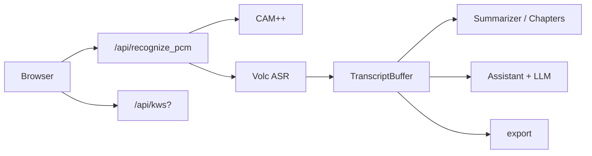

# EchoPass

**自部署的会议实时语音助手**（浏览器录音 → 火山流式 ASR → CAM++ 说话人 → LLM 纪要/章节/会中对话；可选「小云小云」本地唤醒与 TTS）。**云密钥与模型需自建配置**，见 [`config/prod.yaml.example`](config/prod.yaml.example)。详细设计见 [TECHNICAL_OVERVIEW.md](TECHNICAL_OVERVIEW.md)。

**在线试用**：[EchoPass Demo](https://8.130.124.121:8765/)（自签 HTTPS 需「继续访问」；不保证长期可用。）觉得有用欢迎点 **Star** ⭐


## 能做什么

- **实时转写**：火山流式 ASR；**说话人**：CAM++（默认可仅内存，可接 PostgreSQL）
- **纪要 / 章节**：LLM 结构化输出（含会议背景、待办等），失败时规则回退
- **会中助手**：`/api/assistant/*`，可带转写上下文与 TTS
- **语音唤醒**（可选）：`kws.enabled: true` 时本地「小云小云」KWS，**默认关闭**
- **导出**：Markdown；会议结束后 ZIP（音频 + 转录 + 纪要）

**栈**：Python 3.8 · FastAPI · `echopass/static` · Uvicorn · 可选 Docker。

## 架构（简）



## 快速开始

1. **Python 3.8** 环境（推荐 conda）→ 在仓库根执行 **`./scripts/first-run.sh`**（装依赖并生成 `config/prod.yaml` 模板，若已有则不覆盖）。
2. 编辑 **`config/prod.yaml`**，至少填 **LLM**（`llm.api_url` / `api_key` / `model`）与 **火山 ASR**（`asr.volc.appid` / `token`）。存在 `config/prod.yaml` 时一般**不必**设 `ECHOPASS_CONFIG`。
3. **首次**拉模型需联网：`FORCE_ONLINE=1 ./scripts/run.sh`。**日常**：`./scripts/run.sh`；Windows 用 `.\scripts\run.ps1`。详见 **[docs/LOCAL_QUICKSTART.md](docs/LOCAL_QUICKSTART.md)**。
4. 浏览器默认 **`https://127.0.0.1:8765`**。

**常用配置**（完整表见 [config/prod.yaml.example](config/prod.yaml.example)）：`speaker.pg_dsn`（声纹落库）、`kws.enabled`、`preload_models`、`tts.*`。

## Docker

```bash
docker build -t echopass:1.0 .
docker run -d -p 8765:8765 -v $PWD/config/prod.yaml:/app/config/prod.yaml:ro -e ECHOPASS_CONFIG=config/prod.yaml echopass:1.0
```

（GPU 见原镜像说明；`Dockerfile` 可调整。）

## API 与事件（速览）

`GET /api/health` · `POST /api/recognize_pcm` · `POST /api/meeting/summary` · `POST /api/meeting/chapters` · `POST /api/meeting/export` · `POST /api/assistant/reply` · `WS /ws/control` — 完整列表与参数见 [TECHNICAL_OVERVIEW.md](TECHNICAL_OVERVIEW.md)。

## 常见问题

- **麦克风 / HTTPS**：非 `localhost` 需安全上下文，见 [LOCAL_QUICKSTART](docs/LOCAL_QUICKSTART.md)。
- **首启慢 / 预加载失败**：拉模型用 `FORCE_ONLINE=1 ./scripts/run.sh`；若报火山 ASR 凭据，在 `config/prod.yaml` 补全 `asr.volc.appid` / `token` 后重启。
- **更细问题**（ModelScope 版本、PostgreSQL、纪要不生成等）：见 [LOCAL_QUICKSTART](docs/LOCAL_QUICKSTART.md) 与 [TECHNICAL_OVERVIEW](TECHNICAL_OVERVIEW.md) 的故障与配置章节。

## 安全与许可证

勿将真实密钥提交到 Git；`config/prod.yaml` 在 [.gitignore](.gitignore)。曾泄露的密钥应在云侧**轮换**。公开仓库前请确认历史无密文，必要时用 [git filter-repo](https://github.com/newren/git-filter-repo) 等清洗。

- 许可证 [MIT](LICENSE)。CAM++ 裁剪见 [NOTICE](NOTICE)；KWS 依赖 [FunASR](https://github.com/modelscope/FunASR)。

## 文档索引

- [docs/LOCAL_QUICKSTART.md](docs/LOCAL_QUICKSTART.md) — 分平台安装与启动  
- [TECHNICAL_OVERVIEW.md](TECHNICAL_OVERVIEW.md) — 接口、架构、环境变量  
- [config/prod.yaml.example](config/prod.yaml.example) — 配置模板  
